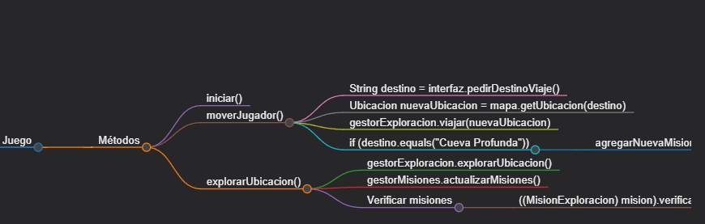
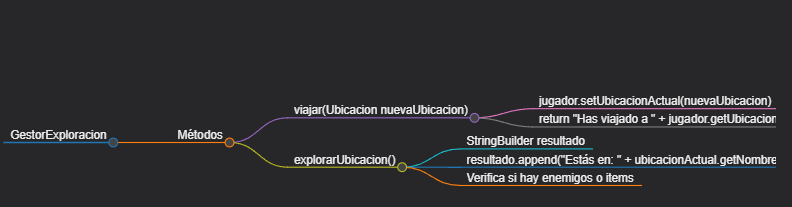
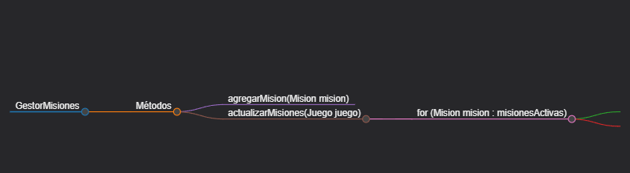
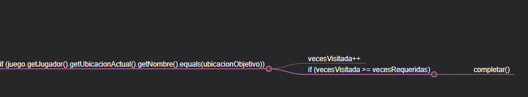

# 🏰 RPG-EX en Java

## 📜 Intro

Este proyecto es un juego de RPG basado en texto, desarrollado en Java. Tenemos un mundo donde podremos explorar diversos lugares, enfrentarnos a enemigos y descubrir tesoros.

---

## 🎮 Características Principales

- 🗺️ Explorar múltiples ubicaciones
- ⚔️ Combatir contra enemigos
- 🎒 Gestionar el inventario
- 🏃‍♂️ Moverse entre diferentes lugares
- 🧪 Recoger y utilizar objetos
- 📜 Completar misiones mientras exploras

---

## 🏗️ Estructura del Proyecto

### 🔧 Clase Principal
- `ui.Juego`: El centro del juego, coordina todas las acciones.

### 👨‍💼 Gestores
- `GestorCombate`: Gestiona las peleas.
- `GestorExploracion`: Guía de la aventura.
- `GestorInventario`: Organiza los objetos.
- `GestorMisiones`: Gestiona las misiones activas y completadas del jugador.

### 🧱 Modelos
- `Jugador`: El personaje en el juego.
- `Enemigo`: Los enemigos en el juego.
- `Ubicacion`: Los lugares de la aventura.
- `Mapa`: El mundo a explorar.
- `Item`: Objetos que te ayudarán en el juego.
- `MisionExploracion`: Un tipo de misión que requiere que el jugador explore ubicaciones específicas.

### 🖥️ Interfaz de Usuario
- `Interfaz`: Herramienta que nos muestra el juego.

---

## 🧠 Principios SOLID Aplicados

1. **Principio de Responsabilidad Única (SRP)** 🎯
   - Cada clase tiene un propósito único y bien definido.

2. **Principio de Abierto/Cerrado (OCP)** 🚪
   - `Item` usa `EfectoItem`, permitiendo nuevas funcionalidades sin modificar lo existente.

3. **Principio de Sustitución de Liskov (LSP)** 🔄
   - `Jugador` y `Enemigo` heredan de `Entidad`, manteniendo consistencia en el combate.

---

## 📚 Clases y Documentación

### 1. Clase `Juego`

La clase `Juego` es la clase principal que coordina todas las acciones del jugador, incluyendo el movimiento, la exploración y la gestión de misiones.



#### Documentación
- **iniciar()**: Inicia el ciclo del juego, gestionando las interacciones del jugador con el juego.
- **moverJugador()**: Mueve al jugador a una nueva ubicación y, si corresponde, agrega nuevas misiones.
- **explorarUbicacion()**: Permite al jugador explorar la ubicación actual, verificando y actualizando el estado de las misiones.

### 2. Clase `GestorExploracion`

El `GestorExploracion` maneja la lógica de exploración y movimiento del jugador entre ubicaciones.


#### Documentación
- **viajar(Ubicacion nuevaUbicacion)**: Mueve al jugador a la ubicación especificada.
- **explorarUbicacion()**: Gestiona la lógica de exploración, verificando enemigos, items, y otras características de la ubicación.

### 3. Clase `GestorMisiones`

El `GestorMisiones` se encarga de gestionar las misiones activas y completadas del jugador.

#### Documentación
- **agregarMision(Mision mision)**: Agrega una nueva misión a la lista de misiones activas.
- **actualizarMisiones(Juego juego)**: Revisa y actualiza el estado de las misiones activas, moviendo las completadas a la lista correspondiente.

### 4. Clase `MisionExploracion`

La `MisionExploracion` es un tipo de misión que requiere que el jugador explore una ubicación específica.


#### Documentación
- **verificarYActualizar(Juego juego)**: Verifica si el jugador ha alcanzado la ubicación objetivo y si se cumplen las condiciones para completar la misión.

---

### 5. Adición de una Mision al Juego

Para agregar una nueva misión al juego, se debe crear una nueva clase que herede de `Mision` e implemente el método `verificarYActualizar(Juego juego)`.

```java

public class MisionEjemplo extends Mision {

    private Ubicacion ubicacionObjetivo;

    public MisionEjemplo(String descripcion, Ubicacion ubicacionObjetivo) {
        super(descripcion);
        this.ubicacionObjetivo = ubicacionObjetivo;
    }

    @Override
    public void verificarYActualizar(Juego juego) {
        if (juego.getJugador().getUbicacionActual().equals(ubicacionObjetivo)) {
            completada = true;
        }
    }
}  
   
```
Verificar siempre que la misma se agregue al `GestorMisiones` para que sea gestionada correctamente.

### 6. BUG `Mision`

Dentro del mismo codigo esta un bug el cual no pude encontrar la solucion, el cual es que al completar una mision, esta no se elimina de la lista de misiones activas, por lo que se puede completar la misma mision varias veces.

### 7. Items `Item`

Como uno de los otro issue que se puede agregar sobre esto es que cada mision de una recompensa por completar la misma
 es recomendable que se agrega una clase dentro del gesto de items, para que se pueda agregar una recompensa por completar la mision.


## 🚀 Cómo Jugar

1. Ejecutá la clase `ui.Juego`.
2. Seguí las instrucciones en pantalla para navegar y tomar decisiones.
3. Explorá, luchá y sobreviví en este mundo de aventuras.

---

## 🤝 Contribuciones

Las contribuciones se organizarán a través de GitHub con issues y pull requests.
